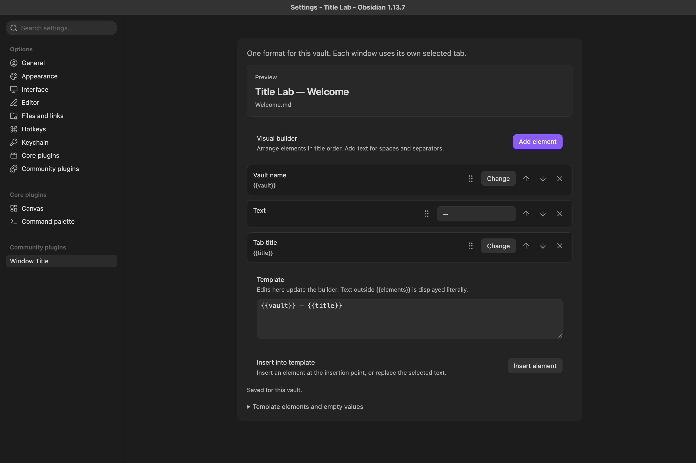

# Window Title

Compose Obsidian window titles with a visual builder and an editable template. One format applies to the vault; each window uses its own selected tab.

The default puts the vault first:

```text
{{vault}} — {{title}}
```



Reorder elements, insert fixed text, or add frontmatter properties using the searchable element picker. Dragging uses the full element tile; an accent line marks the exact insertion point before or after a tile. Changes in the builder update the template, and valid template edits update the builder. A preview shows the result for the content window used when settings opened.

## Elements

| Element | Template | Example |
| --- | --- | --- |
| Vault name | `{{vault}}` | `Work` |
| Tab title | `{{title}}` | `Planning` or `Graph` |
| File name | `{{filename}}` | `Planning.md` |
| File name without extension | `{{basename}}` | `Planning` |
| Folder path | `{{folder}}` | `Projects` |
| File path | `{{filepath}}` | `Projects/Planning.md` |
| Frontmatter property | `{{frontmatter["project"]}}` | `Research` |

The property picker searches top-level frontmatter names found anywhere in the vault. A property can be selected even when the current note has no value for it. Quoted property names support spaces, punctuation, and Unicode; `{{frontmatter["customer name"]}}` refers to that exact key. Values always come from the file selected in the relevant window.

Text outside an element is literal. In the builder, add a Text element for words, spaces, or separators. Prefix a brace or backslash with a backslash to display it literally in the template. Repeated elements are supported. Conditions, expressions, and executable code are not supported.

## Empty values and editing

Non-file views have a tab title but no file path or frontmatter. Missing values are empty, while separators remain. The displayed window title collapses repeated ASCII spaces and trims surrounding spaces, matching `Document.title`. The saved template retains its literal text.

Numbers and booleans include `0` and `false`. Scalar lists use commas; structured values use compact JSON. Values render on a single line, and the title is capped at 2,048 Unicode code points. A completely empty result uses the vault name.

An unfinished or invalid template stays in the editor with an explanation. The builder and real titles retain the last valid format until the edit becomes valid. Titles update on every edit; settings are written to the vault once typing pauses, and immediately when Settings closes. External settings updates do not silently erase an unfinished edit.

## Installation

Requires desktop Obsidian 1.13.0 or later. The plugin targets macOS, Linux, and Windows. Native behavior is verified separately from source/build compatibility; see [testing](docs/testing.md) for current coverage.

For manual installation:

1. Download `main.js`, `manifest.json`, and `styles.css` from a [GitHub release](https://github.com/igorhajduk/obsidian-window-title/releases).
2. Create `<vault>/.obsidian/plugins/window-title` and place the three files directly inside it.
3. Reload Obsidian and enable **Window Title** in Community plugins.
4. Open **Settings → Window Title** to edit the format.

For a local build, copy the generated `dist/window-title` folder into `<vault>/.obsidian/plugins/`.

## Scope and compatibility

The plugin updates titles of existing content windows. It does not create, arrange, or save windows, change tab captions, rename files, or modify note content. Separate Settings windows retain their standard titles.

The shipped code uses public Obsidian APIs and standard Web APIs. It observes core title updates so disabling the plugin can restore the current standard title. It makes no network requests and does not use private title methods, Electron remote, or OS-specific scripts.

Another plugin can replace the visible titlebar independently of the OS title. Competing title writers cannot both control the same title reliably; a rapid conflict pauses this plugin in the affected window. Disable the competing override and re-enable Window Title to resume.

## Development

```sh
npm ci
npm run check
npm run package
```

`npm run package` creates the installable folder and SHA-256 checksums. CI defines source/test/build jobs for macOS, Linux, and Windows. These jobs do not run a desktop Obsidian instance.

The local macOS integration harness targets only this checkout's disposable `.lab/Title Lab` vault and checks the exact path before evaluation. Prepare it with `npm run lab:prepare`; run `npm run lab:test` after opening it in Obsidian with the CLI and plugin enabled. Runtime harnesses must run sequentially. Development diagnostics use host internals for setup and native readback; they are excluded from the plugin bundle.

## License

[MIT](LICENSE).
